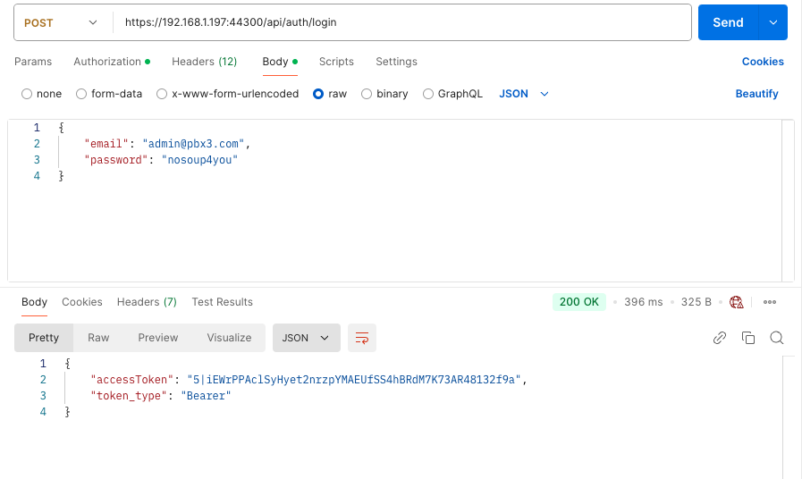
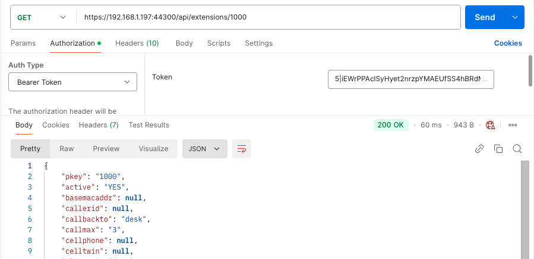

# Authorization

Before you can use the API you must be authorised. pbx3api uses **Laravel Sanctum**: token-based auth, similar to GitHub personal access tokens. You need a **Bearer token** for all protected requests.

**Ways to get a token:**

- An administrator creates a user with email/password. You **login** with those credentials and receive a Bearer token to use in the `Authorization` header for subsequent requests.
- An administrator creates a user and gives you the Bearer token directly; you use it without logging in.

As an **unauthorised** user, the only endpoint you can call is **login**. All other requests must include a Bearer token in the `Authorization` header.

**Abilities:** Each user has a list of **abilities** (e.g. `admin`, `viewer`). The token issued at login gets that same list. Routes are protected by ability; for example, user management and most resources require the `admin` ability. The list of valid ability names is defined in the API (see `config/abilities.php`). One ability is a string; a user or token has an **array** of ability strings.

---

## Auth requests

### Login  
**POST /auth/login**

**Body**
```
email     (required)  string, email
password  (required)  string
remember_me (optional) boolean
```

**Response (200 OK)**  
`accessToken` (Bearer token), `token_type` (e.g. `"Bearer"`). Use `accessToken` in the `Authorization: Bearer <token>` header for subsequent requests.

---

### Logout  
**GET /auth/logout**

Requires a valid Bearer token. Revokes **the current token** only (other sessions/tokens for that user remain valid).

**Response (200 OK)**  
`message`: e.g. `"Successfully logged out"`.

---

### Register  
**POST /auth/register**

Only an authenticated user with the **admin** ability can register a new user. The request body can include `abilities`; only ability names from the API lexicon are accepted.

**Body**
```
name       (required)  string
email      (required)  string, email, unique
password   (required)  string
abilities  (optional)  array of strings, e.g. ["admin"] — only names from the ability lexicon
endpoint   (optional)  numeric
```

**Response (201 Created)**  
`message`, `accessToken` (Bearer token for the new user), `abilities` (array of abilities assigned to the new user).

---

### Whoami  
**GET /auth/whoami**

Returns the authenticated user and the **abilities of the current token**.

**Response (200 OK)**  
User fields (e.g. `id`, `name`, `email`) plus `abilities`: array of strings (e.g. `["admin"]`). Use this to show “logged in as …” and to drive ability-based UI (e.g. show admin menu only if `abilities` includes `admin`).

---

## Users (admin only)

These endpoints require the **admin** ability.

| Method | Path | Description |
|--------|------|-------------|
| GET | /auth/users | Index of all users |
| GET | /auth/users/{id} | User by id |
| GET | /auth/users/mail/{email} | User(s) by email |
| GET | /auth/users/name/{name} | User(s) by name |
| GET | /auth/users/endpoint/{endpoint} | User(s) by endpoint |
| DELETE | /auth/users/revoke/{id} | Revoke all tokens for user id |
| DELETE | /auth/users/{id} | Delete user by id |

---

## Examples

### Example 1: Login  
  
After login, save the `accessToken` and send it as `Authorization: Bearer <accessToken>` on later requests.

### Example 2: GET with Bearer token  
To retrieve details for extension 1000 (or any protected resource), set the request `Authorization` header to `Bearer <your accessToken>`.  

